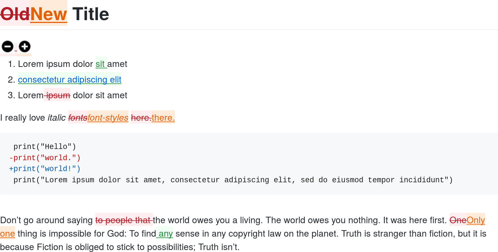
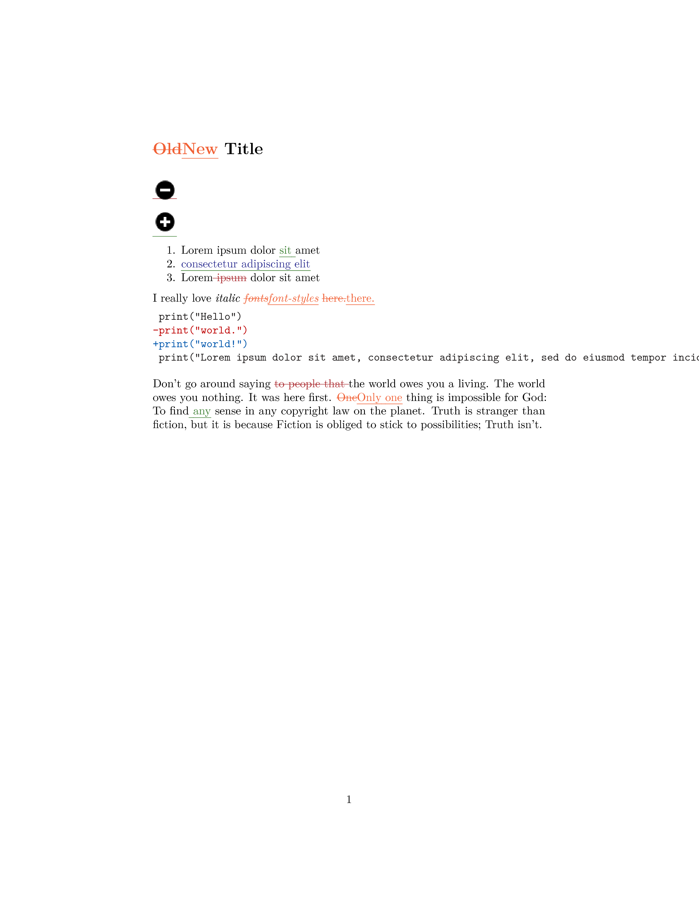

# PanDiff

[](https://travis-ci.org/davidar/pandiff)
[](https://gitpod.io/#https://github.com/davidar/pandiff)

## Features

- Prose diffs for [any document format supported by Pandoc](https://pandoc.org/MANUAL.html)
- Supported output formats:
  - [CriticMarkup](http://criticmarkup.com/)
  - HTML
  - PDF, via LaTeX
  - [Word docx](https://en.wikipedia.org/wiki/Office_Open_XML) with [Track Changes](https://support.office.com/en-us/article/track-changes-in-word-197ba630-0f5f-4a8e-9a77-3712475e806a)
- Respects document structure, so won't produce broken markup like `wdiff`

## Installation

First install [Pandoc](https://pandoc.org/installing.html) and [npm](https://www.npmjs.com/get-npm), then run:

```sh
npm install -g pandiff
```

## Usage

```sh
pandiff test/old.md test/new.md
```

````markdown
{~~Old~>New~~} Title
====================

{----}

{++++}

1.  Lorem ipsum dolor {++sit ++}amet
2.  {++[consectetur adipiscing
elit](https://en.wikipedia.org/wiki/Lorem_ipsum)++}
3.  Lorem{-- ipsum--} dolor sit amet

I really love *italic {~~fonts~>font-styles~~}* {~~here.~>there.~~}

``` diff
 print("Hello")
-print("world.")
+print("world!")
 print("Lorem ipsum dolor sit amet, consectetur adipiscing elit, sed do eiusmod tempor incididunt")
```

Don’t go around saying {--to people that --}the world owes you a
living. The world owes you nothing. It was here first. {~~One~>Only
one~~} thing is impossible for God: To find{++ any++} sense in any
copyright law on the planet. Truth is stranger than fiction, but it is
because Fiction is obliged to stick to possibilities; Truth isn’t.
````

### Options

```sh
pandiff --help
```

```
Usage: pandiff [OPTIONS] FILE1 FILE2
      --bibliography=FILE
      --csl=FILE
      --columns=NUMBER
      --extract-media=PATH
  -F, --filter=STRING
  -f, --from=FORMAT
  -h, --help
      --highlight-style=STRING
      --lua-filter=FILE
      --mathjax=BOOL
      --mathml=BOOL
  -o, --output=FILE
      --pdf-engine=STRING
      --reference-dic=FILE
      --reference-links
      --resource-path=PATH
  -s, --standalone
  -t, --to=FORMAT
  -v, --version
      --wrap=STRING
```

### Git integration

Configure git by running the following commands:

```sh
git config --global difftool.pandiff.cmd 'pandiff "$LOCAL" "$REMOTE"'
git config --global alias.pandiff 'difftool -t pandiff -y'
```

Now you can use `git pandiff` wherever you would usually use `git diff`.

### HTML output

```sh
pandiff old.md new.md -s -o diff.html
```

[](https://rawgit.com/davidar/pandiff/master/test/diff.html)

### PDF output

```sh
pandiff old.md new.md -o diff.pdf
```

[](https://rawgit.com/davidar/pandiff/master/test/diff.pdf)

### Word Track Changes

```sh
pandiff old.md new.md -o diff.docx
```

```sh
pandiff test/track_changes_move.docx
```

```markdown
Here is some text.

{++Here is the text to be moved.++}

Here is some more text.

{--Here is the text to be moved.--}
```

### Docker Image
You can run pandiff inside a docker container locally on your machine by mounting the needed directory as a volume, using the following command.

```sh
docker run -v ~/documents/my-md-documents:/data davidar/pandiff -o diff.pdf old.md new.md
```

The docker image also allows you to create diff views inside github actions or a gitlab ci/cd pipeline.

#### GitHub Action
```yaml
name: Markdown Diff

on:
  push:
    paths:
      - '**.md'
  workflow_dispatch:

jobs:
  compile-markdown-to-pdf:
    runs-on: ubuntu-latest
    steps:
      - name: Checkout repository
        uses: actions/checkout@v4

      - name: Run pandiff
        run: |
          docker run --rm \
            -v ${{ github.workspace }}:/work \
            -w /work \
            davidar/pandiff \
            pandiff -o diff.pdf old.md new.md

      - name: Upload artifact
        uses: actions/upload-artifact@v4
        with:
          name: diff-pdf
          path: diff.pdf
```


#### Gitlab CI example
```yaml
stages:
  - diff

compile_markdown_to_pdf:
  stage: compile
  image:
    name: davidar/pandiff
    entrypoint: ["/bin/sh", "-c"]

  script:
    - pandiff -o diff.pdf old.md new.md
  artifacts:
    paths:
      - diff.pdf
```
